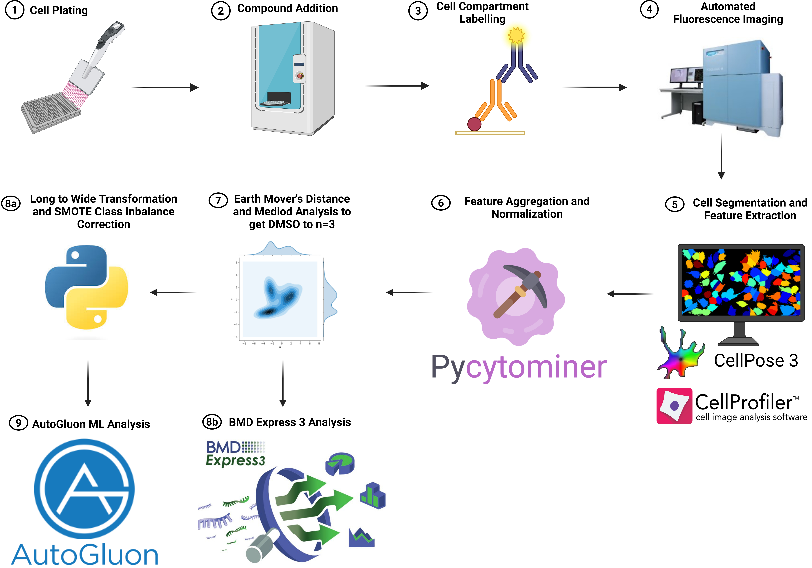

# iDILI-Predict

**Morphological profiling for drug-induced liver injury (DILI) prediction using Cell Painting and AutoML.**

iDILI-Predict takes well-level CellProfiler features from high-content screening plates containing DILI compound libraries and negative controls, normalizes them using MAD robustize, and trains AutoGluon ensemble models with compound-grouped cross-validation to predict DILI risk.



## Overview

```
Input CSV                    column_dtypes.csv
(well-level features)        (feature vs metadata)
       |                            |
       v                            v
  ┌─────────────────────────────────────┐
  │  1. Load & validate columns         │
  │  2. Encode labels (PC=1, NC=0)      │
  │  3. Impute missing (plate medians)  │
  │  4. MAD robustize per plate         │
  │  5. AutoGluon (group-aware CV)      │
  │  6. OOF predictions & metrics       │
  └─────────────────────────────────────┘
       |
       v
  results/
  ├── oof_predictions.csv
  ├── leaderboard.csv
  └── autogluon_model/
```

**Key design choice:** Cross-validation splits are grouped by compound (`Metadata_CMPD`) to prevent data leakage — the same compound at different doses never appears in both training and validation folds.

## Installation

```bash
git clone https://github.com/SextonLab/iDILI-Predict.git
cd iDILI-Predict
pip install -e .
```

For notebook dependencies (UMAP, scanpy, etc.):

```bash
pip install -e ".[notebooks]"
```

## Quick Start

Run the pipeline on the included example data (63D cell line, ~1100 wells):

```bash
python -m idili_predict \
    --input example_data/63D_well_median_fixed.csv \
    --dtypes example_data/column_dtypes.csv \
    --output-dir results/ \
    --time-limit 300
```

Or use the interactive notebook: `notebooks/walkthrough.ipynb`

## CLI Reference

| Flag | Short | Default | Description |
|------|-------|---------|-------------|
| `--input` | `-i` | *required* | Input CSV with well-level features |
| `--dtypes` | `-d` | *required* | Path to `column_dtypes.csv` |
| `--output-dir` | `-o` | `results` | Output directory |
| `--time-limit` | `-t` | `2000` | AutoGluon training time (seconds) |
| `--presets` | | `best_quality` | AutoGluon presets |
| `--num-bag-folds` | | `5` | Number of CV folds |

## Input Data Format

### Feature CSV

A CSV file where each row is one well, containing both metadata and CellProfiler feature columns.

**Required metadata columns:**

| Column | Description | Example |
|--------|-------------|---------|
| `Metadata_PlateID` | Plate identifier | `ScreeningPlate1` |
| `Metadata_WellID` | Well position | `A01` |
| `Metadata_CMPD` | Compound name | `Acetaminophen` |
| `Metadata_CONC` | Concentration (numeric) | `10.0` |
| `Metadata_COND` | Condition label | `PC` or `NC` |

- **PC** (Positive Control) = DILI-positive compounds (labeled 1)
- **NC** (Negative Control) = DILI-negative compounds (labeled 0)
- **DMSO** wells (identified by `Metadata_CMPD == "DMSO"`) are automatically labeled as NC

### column_dtypes.csv

Defines which columns are features vs metadata. Two columns: `ColumnName` and `ColumnType`.

```csv
ColumnName,ColumnType
ImageNumber,metadata
Metadata_CMPD,metadata
Cell_AreaShape_Area,feature
Cell_AreaShape_Perimeter,feature
...
```

## Output Files

| File | Description |
|------|-------------|
| `01_raw_data_with_labels.csv` | Input data with encoded labels |
| `02_normalized_features.csv` | MAD-robustized features |
| `oof_predictions.csv` | Out-of-fold predicted probabilities per well |
| `leaderboard.csv` | AutoGluon model rankings |
| `column_dtypes.csv` | Copy of input dtypes file |
| `autogluon_model/` | Trained model directory |

## Notebooks

| Notebook | Description |
|----------|-------------|
| `walkthrough.ipynb` | Step-by-step pipeline demo with visualizations |
| `umap_visualization.ipynb` | UMAP embedding with StandardScaler, Harmony batch correction, PCA, and Leiden clustering |

## Package Structure

```
idili_predict/
├── cli.py         # Command-line interface
├── pipeline.py    # Pipeline orchestrator
├── normalize.py   # MAD robustize via pycytominer
└── utils.py       # Data loading, validation, imputation
```

## Citation

If you use iDILI-Predict in your research, please cite:

```bibtex
@article{sexton2026idilipredict,
  title={iDILI-Predict: Morphological Profiling for Drug-Induced Liver Injury Prediction},
  author={Sexton, Jonny},
  journal={},
  year={2026}
}
```

## License

MIT License. See [LICENSE](LICENSE) for details.
